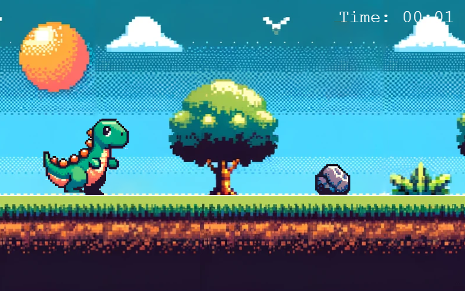

# Dinosaur Runner Game

This project is a browser-based game developed using PhaserJS. It is inspired by the classic dinosaur runner game found in Google Chrome. The game features a dinosaur character that must jump over obstacles. The gameplay continues until the dinosaur collides with an obstacle, at which point the game displays a game over screen and offers an option to restart.




## Features

- **Endless Runner**: The dinosaur runs endlessly with increasing difficulty.
- **Collision Detection**: The game ends when the dinosaur collides with an obstacle.
- **Score Tracking**: A timer tracks the duration of the current game.
- **Game Over Screen**: A screen that shows when the game ends, with an option to restart.
- **Responsive Design**: Compatible with various screen sizes.

## How to Play

- **Start the Game**: Load the game in your browser to start playing.
- **Jump**: Press the `up arrow` key to make the dinosaur jump over obstacles.
- **Restart**: Click the 'Restart' button to play again after a game over.

## Technologies Used

- **PhaserJS**: A fast, free, and fun open-source framework for Canvas and WebGL powered browser games.
- **TypeScript**: A typed superset of JavaScript that compiles to plain JavaScript.
- **HTML/CSS**: For structuring and styling the game's webpage.

## Setup and Installation

1. **Clone the Repository**
   ```bash
   git clone https://github.com/MyNameIsCarsten/phaser-typescript-dino-runner
   cd dinosaur-runner-game
   ```

2. **Install Dependencies**
   ```bash
   npm install
   ```

3. **Run the Game**
   ```bash
   npm start
   ```

## Contributing

Contributions to the game are welcome. If you have a suggestion that would make this better, please fork the repo and create a pull request.


## Acknowledgements

- [PhaserJS Documentation](https://phaser.io/docs)
- [Original Chrome Dinosaur Game](https://en.wikipedia.org/wiki/Dinosaur_Game)
